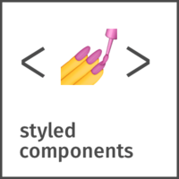

### Hi there, I'm [Ilhan!] 👋

 
**Languages and Tools:**  

### Frontend

### Backend

 

### etc

 

<!--- 
  if you have forked this to use on your profile, 
  Change the `github-readme-stats.jihunhong.vercel.app` to `github-readme-stats.vercel.app` 
--->

<!-- Change the `github-readme-stats.jihunhong.vercel.app` to `github-readme-stats.vercel.app`  -->

*NOTE: Top languages does not indicate my skill level or something like that, it's a github metric of which languages i have the most code on github, it's a new feature of [github-readme-stats](https://github.com/jihunhong/github-readme-stats)*

